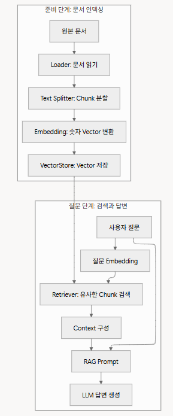

**오늘의 한 줄 평:** 파이썬 코드도 익숙하지 않고 AI도 어렵다. 그래도 예제 중 1개 파일 파이썬 코드 한줄씩 이해하기 시도했다. OpenAI Embedding을 이용한 RAG(Retrieval-Augmented Generation, 검색 증강 생성) 예제로, 이번 예제는 RAG의 Retrieval 단계만 구현 했다. OpenAI Embedding과 코사인 유사도를 이용하여 질문과 가장 유사한 문서를 검색하는 과정을 학습하였다. 문서에 정답이 없으면 가장 비슷한 내용을 가져오고, 그 결과도 유사도(score)가 낮게 나온다.
#### 꿀팁 
# 2026-07-21 수업 72일차
#### 가상환경 선택
- Ctrl + Shift + P -> "> Python : select interpreter"
- conda activate pystudy_env  
- conda info --envs
---

#### LangChain, RAG
- Hermes, Google Deep search
- RAG : 
Retrieval = 관련 정보를 검색
Augmented = 검색 정보를 질문에 추가
Generation = LLM이 최종 답변 생성
- RAG 활용 사례 : Q&A


#### 핵심 용어
- Metadata : 글을 분별 할 때
- Loader	파일을 읽고 출처를 보존	TXT, PDF, 웹 페이지	Document 목록
- Document	내용과 metadata를 묶은 객체	텍스트, 파일명	page_content, metadata
- Text Splitter	긴 문서를 검색 단위로 분리	Document	Chunk 목록
- Embedding	텍스트 의미를 숫자로 표현	질문 또는 Chunk	Vector
- VectorStore	Vector와 원문을 저장	Chunk Vector	검색 가능한 저장소
- Retriever	질문과 가까운 Chunk 선택	질문 Vector	상위 k개 Chunk
- Context	LLM에 제공할 검색 근거	검색된 Chunk	프롬프트용 문자열
- LLM	Context를 읽고 답변 생성	질문과 Context	자연어 답변

# 수업 코드 이해하기 (06_openai_embeding_rag.py)
## OpenAI Embeddings API를 이용한 RAG
---

## 1. 문서 Chunk 분할

### 코드

```
def split_text(text: str, max_chars: int = 180) -> list[str]:
    """긴 문서를 작은 chunk로 나눈다."""

    paragraphs = [
        paragraph.strip()
        for paragraph in text.split("\n\n")
        if paragraph.strip()
    ]

    chunks: list[str] = []
    current = ""

    for paragraph in paragraphs:
        if len(current) + len(paragraph) + 1 <= max_chars:
            current = f"{current}\n{paragraph}".strip()
        else:
            if current:
                chunks.append(current)
            current = paragraph

    if current:
        chunks.append(current)

    return chunks
```

### 설명

- 긴 문서를 Embedding하기 전에 일정 크기의 Chunk로 나누기 위한 함수이다.
- `split("\n\n")`으로 문서를 문단 단위로 분리한다.
- `strip()`을 이용하여 문단 앞뒤 공백을 제거하고, 공백만 있는 문단은 제외한다.
- `current`에는 현재 만들고 있는 Chunk를 저장하고, `chunks`에는 완성된 Chunk를 저장한다.
- 현재 Chunk에 새로운 문단을 추가했을 때 `max_chars`를 넘지 않으면 이어 붙이고, 초과하면 기존 Chunk를 저장한 후 새로운 Chunk를 생성한다.

---

## 2. 코사인 유사도 계산

### 코드

```
def cosine_similarity(left: list[float], right: list[float]) -> float:

    dot = sum(a * b for a, b in zip(left, right))
    left_size = math.sqrt(sum(a * a for a in left))
    right_size = math.sqrt(sum(b * b for b in right))

    if left_size == 0 or right_size == 0:
        return 0.0

    return dot / (left_size * right_size)
```

### 설명

- 두 Embedding 벡터의 유사도를 계산하는 함수이다.
- `zip()`을 이용하여 같은 위치의 원소끼리 곱한 후 모두 더해 내적(Dot Product)을 계산한다.
- 각 벡터의 크기(Vector Length)를 계산한다.
- 코사인 유사도 공식을 이용하여 최종 유사도를 계산한다.
- 벡터의 길이가 0인 경우 0으로 나누는 오류를 방지하기 위해 `0.0`을 반환한다.

---

## 3. Embedding 생성

### 코드

```
def create_embeddings(texts: list[str]) -> list[list[float]]:
    """OpenAI Embeddings API로 문장을 vector로 바꾼다."""

    from openai import OpenAI

    client = OpenAI()

    response = client.embeddings.create(
        model="text-embedding-3-small",
        input=texts,
    )

    return [item.embedding for item in response.data]
```

### 설명

- OpenAI Embeddings API를 호출하여 문장을 Embedding Vector로 변환하는 함수이다.
- `text-embedding-3-small` 모델을 사용한다.
- 문자열 리스트를 한 번의 API 호출로 전달하여 여러 문장의 Embedding을 동시에 생성한다.
- API 응답에서 `embedding`만 추출하여 리스트 형태로 반환한다.

---

## 4. Retrieval

### 코드

```
def retrieve(question: str,
             chunks: list[str],
             top_k: int) -> list[tuple[float, str]]:

    embeddings = create_embeddings([question] + chunks)

    question_embedding = embeddings[0]
    chunk_embeddings = embeddings[1:]

    scored_chunks = [
        (
            cosine_similarity(question_embedding, chunk_embedding),
            chunk
        )
        for chunk, chunk_embedding in zip(chunks, chunk_embeddings)
    ]

    return sorted(scored_chunks, reverse=True)[:top_k]
```

### 설명

- 질문과 가장 유사한 Chunk를 검색하는 Retrieval 함수이다.
- 질문과 모든 Chunk를 한 번에 Embedding API에 전달하여 벡터를 생성한다.
- 첫 번째 Embedding은 질문 벡터, 나머지는 Chunk 벡터로 분리한다.
- 질문 벡터와 각 Chunk 벡터의 코사인 유사도를 계산한다.
- `(유사도, Chunk)` 형태로 저장한 뒤 유사도가 높은 순으로 정렬한다.
- 상위 `top_k`개의 Chunk를 반환한다.

---

## 5. 프로그램 실행

### 코드

```
def main() -> None:

    parser = argparse.ArgumentParser(
        description="OpenAI embedding RAG 실습"
    )

    parser.add_argument("--run", action="store_true")
    parser.add_argument("--document", default=str(DEFAULT_DOCUMENT))
    parser.add_argument("--question", default=DEFAULT_QUESTION)
    parser.add_argument("--top-k", type=int, default=2)

    args = parser.parse_args()

    document_path = Path(args.document)

    if not document_path.exists():
        raise SystemExit("문서 파일이 없습니다.")

    if not os.getenv("OPENAI_API_KEY"):
        raise SystemExit("OPENAI_API_KEY가 없습니다.")

    chunks = split_text(
        document_path.read_text(encoding="utf-8")
    )

    results = retrieve(
        args.question,
        chunks,
        args.top_k
    )

    for rank, (score, chunk) in enumerate(results, start=1):
        print(f"[{rank}] score={score:.4f}")
        print(chunk)
        print()


if __name__ == "__main__":
    main()
```

### 설명

- `argparse`를 이용하여 실행 옵션(문서, 질문, Top-K)을 입력받는다.
- 검색할 문서가 존재하는지 확인한다.
- OpenAI API Key가 존재하는지 확인한다.
- 문서를 읽어 `split_text()`를 통해 Chunk를 생성한다.
- `retrieve()`를 호출하여 질문과 가장 유사한 Chunk를 검색한다.
- 검색된 결과를 순위와 유사도 점수와 함께 출력한다.
- `if __name__ == "__main__"`은 해당 파일을 직접 실행했을 때만 `main()`을 실행하도록 하는 Python의 표준 실행 구조이다.


----
# 수업 예제 AI 요약(참고)

> 오늘 주제: **RAG (Retrieval-Augmented Generation)** — LLM이 모르는 내용을 "검색해서" 답하게 만드는 방법

---

## 오늘 배운 것 요약 (한 문장씩)

1. **RAG란?**: AI가 모르는 내용(학원 규정 같은 것)을 문서에서 찾아본 다음 답하게 만드는 방법을 배웠다.
2. **Document Loader**: 여러 개의 텍스트 파일을 프로그램이 읽을 수 있는 형태로 불러오는 법을 배웠다.
3. **Text Splitter**: 긴 문서를 작은 조각(chunk)으로 자르는 법과, 자르는 크기에 따라 결과가 어떻게 달라지는지 실습했다.
4. **Similarity (유사도)**: 질문과 문장이 얼마나 비슷한지 벡터로 계산하는 법을 배우고, 그 한계도 확인했다.
5. **검색 품질 평가 (Hit@k)**: chunk 크기와 검색 개수(top_k)를 바꿔가며 "검색이 정답 문서를 잘 찾는지" 점수로 확인했다.

---

## 1. RAG가 뭔가요? (`01_no_rag_vs_rag.py`)

### 개념
**RAG = Retrieval(검색) + Augmented(보강된) + Generation(생성)**

AI 모델(LLM)은 학습할 때 본 내용만 알고 있어서, "우리 학원 환불 규정"처럼 원래 몰랐던 정보는 답을 지어내거나("할루시네이션") 모른다고 답합니다. RAG는 질문이 들어오면 먼저 관련 문서를 **검색**해서, 그 내용을 AI에게 "참고자료(Context)"로 같이 던져줍니다. AI는 그 자료 안에서만 답하도록 시킵니다.

쉽게 말해:
- **일반 LLM** = 오픈북 시험인데 책이 없어서 기억으로만 답하는 것
- **RAG** = 시험 볼 때 관련 페이지를 펼쳐주고 "이 안에서만 답 찾아서 써" 하는 것

### 실습 코드에서 확인한 것
```python
no_rag_prompt = f"다음 질문에 아는 내용을 사용해 답하세요.\n\n질문: {question}"

rag_prompt = f"""
아래 Context에 있는 내용만 사용해 질문에 답하세요.
근거가 없으면 '문서에서 관련 근거를 찾을 수 없습니다.'라고 답하세요.
답변 마지막에는 사용한 출처를 [파일명]형식으로 표시하세요.

[Context]
{context}

[Question]
{question}
"""
```
- 같은 질문("수업 시작 24시간 이내에 취소하면 얼마나 환불되나요?")을 **두 가지 프롬프트**로 만들어서 같은 모델에 넣어보고 답변을 비교했다.
- RAG 프롬프트는 "근거 없으면 모른다고 답해라", "출처를 표시해라"라는 규칙을 넣어서, AI가 지어내지 않고 **문서 기반으로만** 답하도록 강제한다는 점이 핵심이었다.

---

## 2. Document Loader — 문서 불러오기 (`02_loader_and_documents.py`)

### 개념
Document Loader는 `data` 폴더 안의 `.txt` 파일들을 하나씩 읽어서, 프로그램이 다루기 쉬운 형태(문서 리스트)로 바꿔주는 역할입니다. 이때 **어느 파일에서 나온 내용인지(source)**도 같이 저장해두는 게 중요합니다. 나중에 "이 답변은 어느 문서에서 나온 근거인지" 표시하려면 이 출처 정보가 꼭 필요하기 때문입니다.

### 실습 코드에서 확인한 것
```python
documents = load_documents(DATA_DIR)
for number, document in enumerate(documents, start=1):
    preview = document["text"][:100]
    print(f"metadata.source: {document['source']}")
    print(f"글자 수: {len(document['text'])}")
```
- `center_policy.txt`, `course_guide.txt`, `lab_manual.txt` 등 오늘 준비된 문서들이 각각 몇 글자인지, 앞부분 미리보기가 어떻게 나오는지 확인했다.
- 문서마다 `source`(파일명)를 붙여두면, 나중에 RAG 답변에 "[center_policy.txt]" 처럼 출처를 표시할 수 있다.

---

## 3. Text Splitter — 문서를 chunk로 자르기 (`03_text_splitter_lab.py`)

### 개념
문서를 통째로 검색에 넣으면 관련 없는 내용까지 다 딸려오고, 너무 잘게 자르면 문맥이 끊깁니다. 그래서 적당한 크기(`chunk_size`)로 자르고, chunk끼리 살짝 겹치게(`overlap_sentences`) 만들어서 **경계에서 문맥이 끊기는 문제를 줄입니다**.

비유하면: 책을 통째로 주면 찾기 힘들고, 한 단어씩 주면 무슨 말인지 모릅니다. 적당한 "문단 단위"로 잘라주고, 문단과 문단 사이에 한 문장 정도는 겹치게 해서 앞뒤 흐름이 안 끊기게 하는 것과 같습니다.

### 실습 코드에서 확인한 것
```python
settings = [
    (120, 0), (120, 1), (260, 1), (50, 0), (50, 1)
]
```
- 같은 `course_guide.txt` 문서를 `chunk_size`와 `overlap_sentences` 값만 바꿔가며 5가지로 잘라봤다.
- chunk_size가 작으면(50) chunk 개수는 늘지만 한 조각에 담기는 의미가 부족해지고, chunk_size가 크면(260) chunk 개수는 줄지만 한 조각에 여러 주제가 섞일 수 있다.
- `overlap_sentences=1`을 주면 chunk 경계에서 문장이 겹쳐서, 잘린 부분의 맥락을 이어서 이해하기 더 쉬워진다.

---

## 4. Similarity — 질문과 문장이 얼마나 비슷한가 (`04_similarity_lab.py`)

### 개념
**Vector(벡터)**는 문장의 의미를 숫자로 표현한 것이고, **Cosine Similarity(코사인 유사도)**는 두 벡터가 얼마나 같은 방향을 가리키는지로 "의미가 얼마나 비슷한지"를 계산하는 방법입니다. 값이 1에 가까울수록 비슷하고, 0에 가까울수록 관련이 없습니다.

### 실습 코드에서 확인한 것 (오늘 실습에서 나온 실제 결과)
```
질문: 수강 취소 환불 규정을 알려주세요
문장: 수강 취소는 수업 시작 24시간 전까지 신청해야 전액 환불된다.
질문 벡터: {'수강': 1, '취소': 1, '환불': 1, '규정을': 1}
문장 벡터: {'수강': 1, '취소는': 1, '수업': 1, ...}
cosine similarity: 0.158
```
```
질문: 수강 취소 환불 규정을 알려주세요
문장: 강의를 듣지 않기로 했다면 낸 비용을 돌려 받을 수 있다.
cosine similarity: 0.000
```
- 이 실습의 vectorize는 **단어를 그대로 세는 방식**(예: '취소'와 '취소는'을 다른 단어로 봄)이라서, 뜻은 완전히 같은 문장인데도("강의를 듣지 않으면 돈을 돌려받는다" = 환불 이야기) 겹치는 단어가 없으면 유사도가 **0.000**이 나왔다.
- 여기서 얻은 교훈: 단순 단어 매칭(키워드 검색)은 "같은 단어를 써야만" 찾을 수 있다는 한계가 있고, 실제 서비스에서는 의미 자체를 이해하는 **진짜 임베딩(Embedding) 모델**(OpenAI Embedding 등)을 써야 이런 패러프레이즈(다른 표현)도 잡아낼 수 있다는 것을 확인했다.

---

## 5. 검색 품질 평가 — Hit@k (`05_retrieval_quality_lab.py`)

### 개념
검색 시스템이 잘 만들어졌는지 "감"으로만 판단하지 않고, **정답이 있는 테스트 질문 세트**를 만들어서 몇 개나 맞았는지 점수(Hit rate)로 측정하는 방법입니다. `Hit@k`는 "상위 k개의 검색 결과 안에 정답 문서가 포함된 비율"을 뜻합니다.

### 실습 코드에서 확인한 것
```python
TEST_CASES = [
    ("수강 취소 환불 기준은 무엇인가요?", "center_policy.txt"),
    ("Text Splitter와 chunk overlap은 왜 필요한가요?", "course_guide.txt"),
    ...
]
SETTINGS = [
    {"chunk_size": 100, "overlap": 0, "top_k": 1},
    {"chunk_size": 180, "overlap": 1, "top_k": 1},
    {"chunk_size": 260, "overlap": 1, "top_k": 2},
]
```
- 질문 8개에 대해 "정답이 나와야 하는 파일명"을 미리 정해두고, chunk_size·overlap·top_k 조합 3가지로 각각 검색을 돌려서 몇 개나 맞혔는지(Hit@k) 비교했다.
- 이렇게 하면 "chunk를 더 크게 자르는 게 나은지", "top_k를 늘리는 게 나은지"를 감이 아니라 **숫자로 비교**할 수 있다는 걸 배웠다.

---

## 오늘 준비된 데이터 파일들

| 파일 | 내용 |
|---|---|
| `center_policy.txt` | 학원 운영 정책 (환불 규정, 결석 시 녹화 영상, 실습실 운영시간) |
| `course_guide.txt` | RAG 강의 안내 (RAG, Loader, Splitter, Embedding, VectorStore, Retriever 개념 설명) |
| `lab_manual.txt` | 실습실 장비·장애 대응 (계정/와이파이 정보, API 키 보관법) |
| `rag_sample_notes.txt` | NumPy·벡터·RAG 관련 개념 노트 |
| `doit_ai_agent.txt` | AI 에이전트 개발 입문서 소개 (GPT API, 랭체인, 랭그래프 등) |

---

## 오늘의 핵심 정리

1. RAG는 "검색 + AI 답변"을 합쳐서, AI가 모르는 최신·내부 정보도 답하게 만드는 방법이다.
2. 문서를 잘 검색하려면 **Loader(불러오기) → Splitter(자르기) → Embedding/Similarity(비교) → Retriever(찾기)** 순서가 필요하다.
3. chunk 크기, overlap, top_k 같은 설정값에 따라 검색 품질이 달라지므로, 감이 아니라 **테스트 케이스로 직접 측정**해봐야 한다.
4. 단순 단어 매칭 방식은 표현이 다르면 유사도를 0으로 판단하는 한계가 있어서, 실제로는 의미 기반 임베딩이 필요하다.